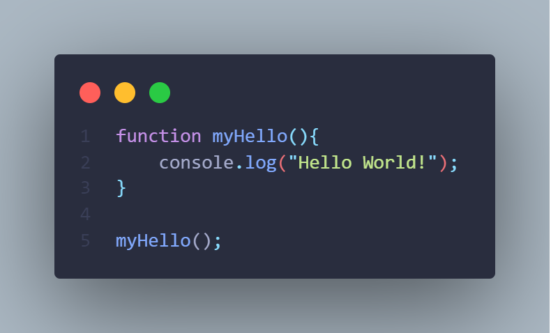
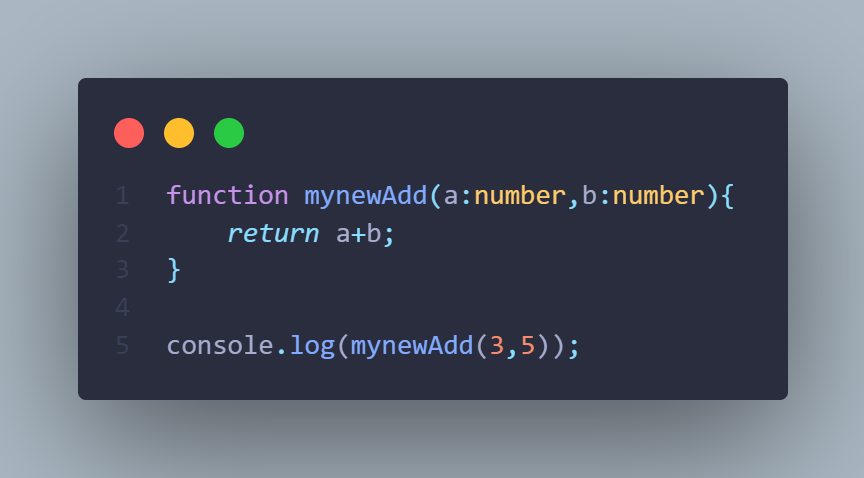

# SONET-MEAN-STACK 2020

### Watch The Live Demo Here: [Github Page](https://gvrs9.github.io/SONET-2020/ "Live Demo link")
 

_**Welcome to my GitHub Page People!**_

 

### Latest assignment code snippets:

#### 1.Hello World Function In TypeScript

 

 

#### 2.Adding Two Numbers Function In TypeScript

 

